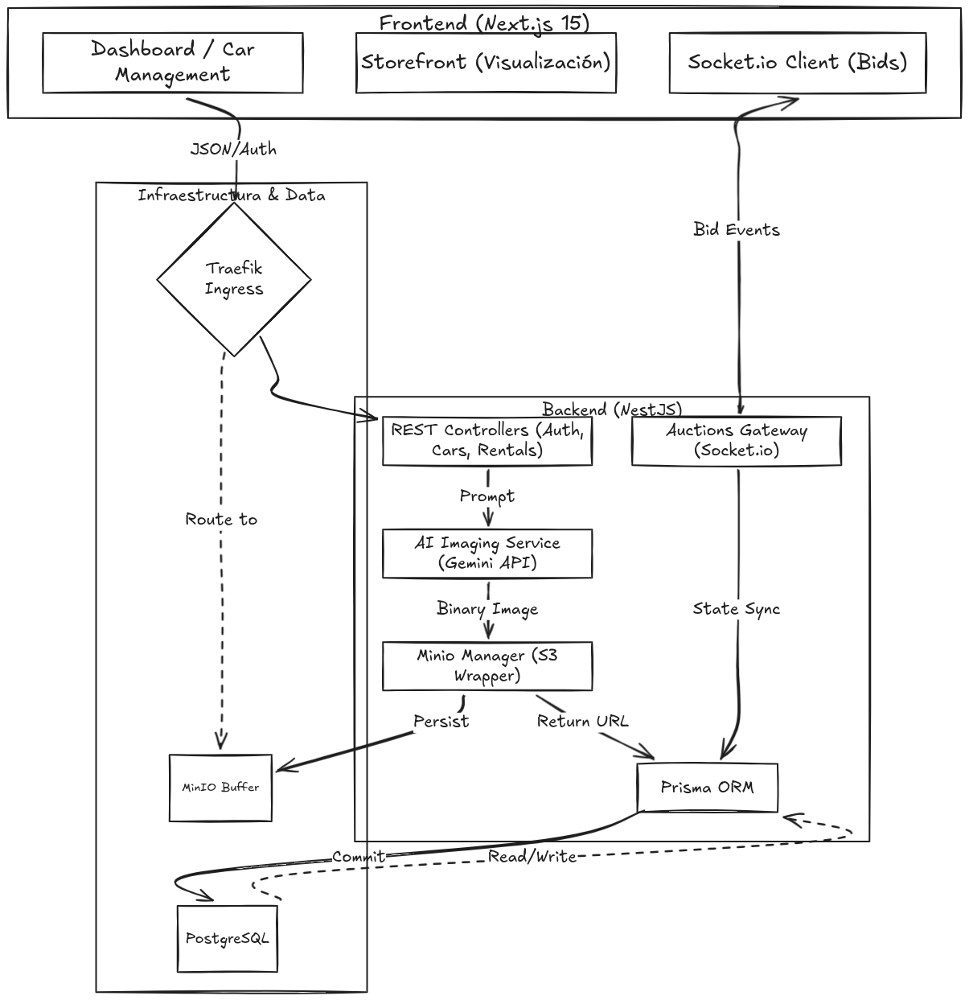
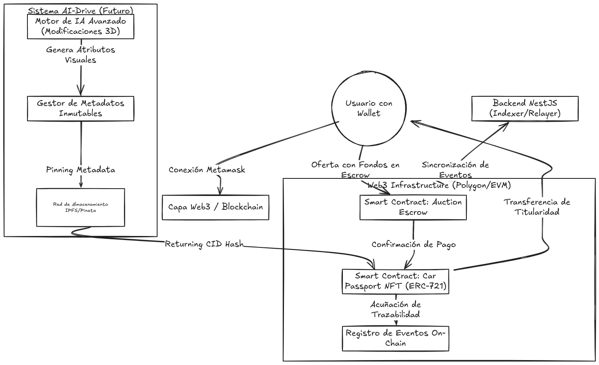

# 🏎️ ApexDrive: El Ecosistema de Hiperdeportivos del Futuro

[](https://opensource.org/licenses/MIT)
[](https://nestjs.com/)
[](https://nextjs.org/)
[](https://www.postgresql.org/)
[](https://www.docker.com/)
[](https://kubernetes.io/)
[](https://traefik.io/)
[](https://min.io/)
[](https://socket.io/)
[](https://ai.google.dev/)
[](https://www.prisma.io/)

---



---

**ApexDrive** es un ecosistema digital de alto rendimiento para hiperdeportivos, que combina subastas en tiempo real, generación de activos por IA y un cimiento Web3 a prueba de futuro. Diseñado para la Hackatón CubePath 2026.

---

## 🚀 Características Clave

### 💎 Marketplace Exclusivo
Explora y adquiere los vehículos más elitistas del mundo con una interfaz minimalista y de alta fidelidad.

### ⏱️ Subastas en Tiempo Real
Participa en guerras de pujas en vivo potenciadas por **WebSockets**. Experimenta latencia de milisegundos para ofertas competitivas.

### 🤖 Generación de Imágenes con IA
Generación dinámica de activos de vehículos utilizando **Gemini 1.5 Flash**. Crea fotografía de nivel de estudio profesional de configuraciones personalizadas al instante.

### ⛓️ Trazabilidad Web3 (Próximamente)
Cada vehículo será acuñado como un **NFT único**, proporcionando un registro inmutable de propiedad, historial de servicio y métricas de rendimiento.

---

## 🛠️ Stack Tecnológico

### Frontend
- **Framework**: Next.js 15 (App Router)
- **Estilos**: Vanilla CSS & Tailwind CSS (Diseño Atómico)
- **Gestión de Estado**: Zustand & React Context
- **Animaciones**: Framer Motion

### Backend
- **Núcleo**: NestJS (Arquitectura Modular)
- **ORM**: Prisma
- **Base de Datos**: PostgreSQL
- **Tiempo Real**: Socket.io (WebSockets)
- **Almacenamiento**: MinIO (Compatible con S3)
- **Motor de IA**: Google Generative AI (Gemini)

### Infraestructura
- **Contenerización**: Docker & Docker Compose
- **Orquestación**: Kubernetes
- **Ingress**: Traefik
- **CI/CD**: Flujos automatizados con Makefile

---

## 🏗️ Arquitectura

El proyecto sigue una **Arquitectura Modular **Basada** en Características (Feature-Based Architecture)**, asegurando alta escalabilidad y mantenibilidad.

> [!TIP]
> Puedes encontrar los diagramas detallados en este README. Para editarlos, puedes usar el código Mermaid original en **Excalidraw** a través de la herramienta "Mermaid to Excalidraw".

---

## 🏁 Comenzando

### Requisitos Previos
- Docker & Docker Compose
- Node.js 20+

### Instalación
1. Clonar el repositorio:
   ```bash
   git clone https://github.com/josesojo2828/apexdrive-hackaton.git
   cd apexdrive-hackaton
   ```

2. Configurar las variables de entorno:
   ```bash
   cp .env.example .env
   ```

3. Levantar la infraestructura:
   ```bash
   make up
   ```

---

## 🗺️ Roadmap: La Evolución Web3



### ¿Qué hace cada componente?
1.  **Capa de Smart Contracts (EVM)**: Maneja la lógica de negocio descentralizada.
    - **Auction Escrow**: Retiene los fondos de los pujadores en un contrato inteligente, asegurando que el vendedor reciba el pago y el comprador reciba el activo (o su dinero de vuelta si pierde).
    - **Car Passport NFT (ERC-721)**: Convierte cada vehículo en un activo digital único. Sus metadatos contienen el historial inmutable de propiedad y servicios.
2.  **Integración de IA & Metadatos Avanzados**:
    - **Advanced AI Node**: Genera configuraciones visuales (tuning) que se guardan como atributos permanentes.
    - **IPFS (Pinata)**: Almacenamiento descentralizado para las imágenes y metadatos, garantizando que el NFT sea persistente y no dependa únicamente de nuestros servidores.
3.  **Registro On-Chain**: Todos los servicios técnicos, ventas y cambios de propiedad se registran como eventos en la blockchain, creando un historial a prueba de manipulaciones.

---

**Desarrollado con ❤️ para QuanticArch para la Hackatón CubePath 2026.**
